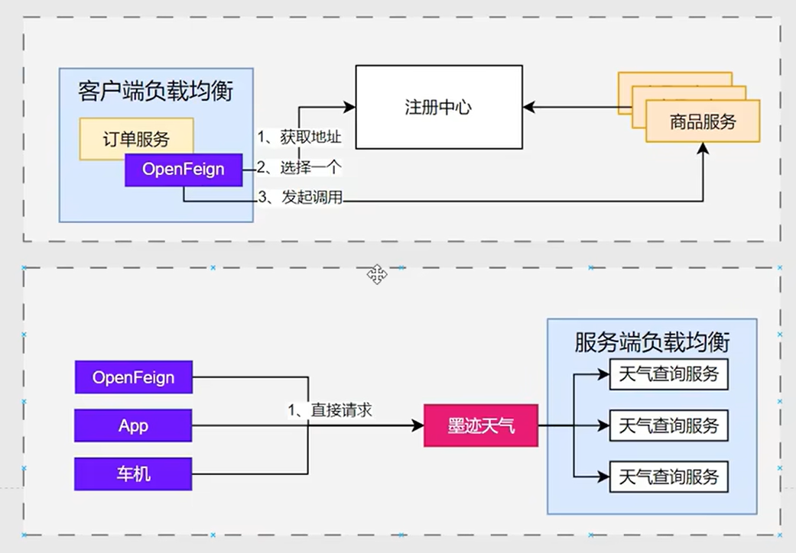
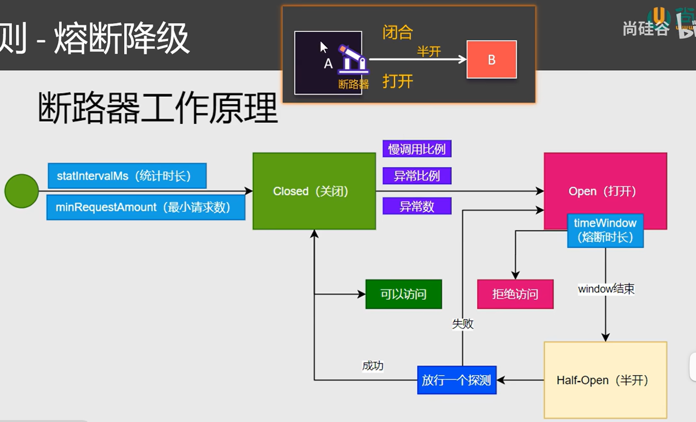
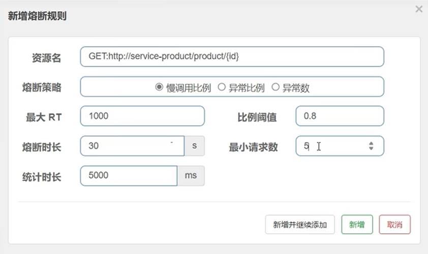
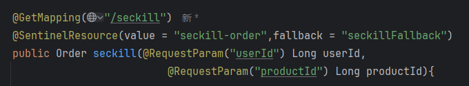
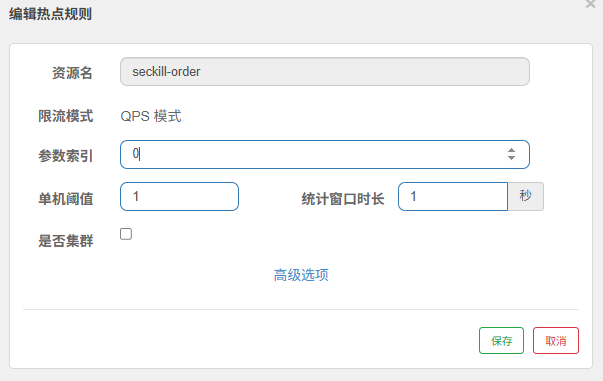
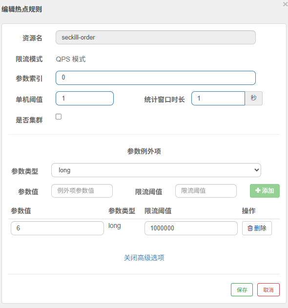
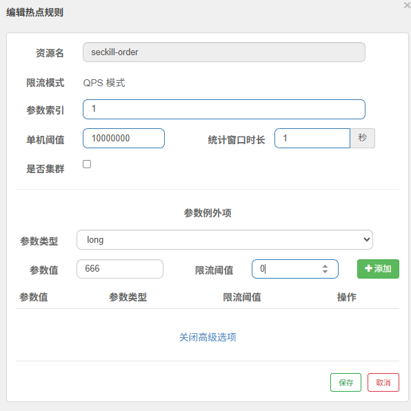
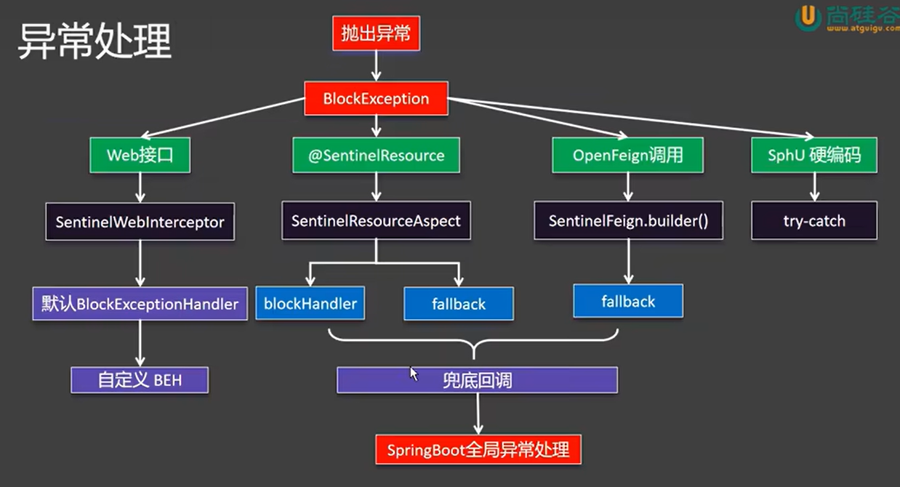
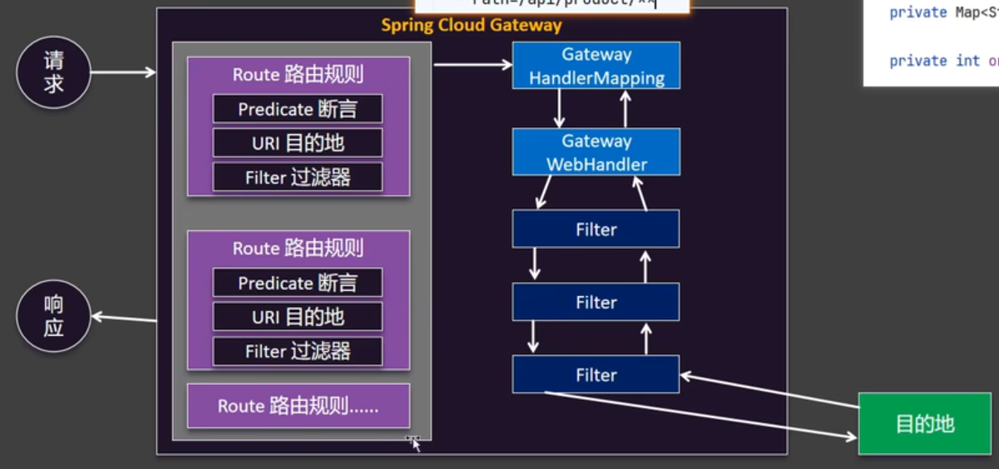

**Q1:注册中心宕机，远程调用还能成功吗？**
答：如果是第一次调用，不能成功；如果调用过，那么远程调用将不再依赖注册中心，可以通过。

**Q2:Nacos中的数据集合application.properties中有相同的配置项，哪个生效**
答：以Nacos配置中心为准。遵循先导入优先①，外部优先②。
①：spring.config.import=nacos:service-order.properties,nacos:common.properties
②：Nacos中的数据集合application.properties中有相同的配置项

**Q3:如何编写好OpenFeign声明式的远程调用接口**
答：对于业务API，直接复制对方controller签名即可；对于第三方API，根据接口文档确定请求如何发

**Q4:客户端负载均衡与服务端负载均衡的区别**
答：

**Q5:熔断降级中，断路器的原理**
答：

**Q6:解释这个熔断规则**
答：最大RT表示如果一个请求在1000ms内没有响应，那么就说明这个请求是一个慢调用。
这个图表示：在5s内，如果有80%的请求都是慢调用，则熔断30s，该30s内的请求都无效。但必须要至少5个请求。
在熔断时长到时后，会发送一个探测请求，如果该请求访问成功，则结束熔断；反之；若仍请求失败，则继续30s的熔断时长。

**Q7:对于Sentinel的热点规则，如何实现以下三个需求？一直代码如下**
**Q7.1:每个用户秒杀QPS不得超过1（秒杀下单userId级别）**
答：
**Q7.2:6号用户是vvip，不限制QPS（例外情况）**
答：
**Q7.3:666号是下架商品，不允许访问**
答：

**Q8:Sentinel异常处理的规则**
答：
注意：兜底处理很重要！！！！！

**Q9:网关过滤流程**
答：

**Q10:网关长写法的注意事项。**
答：- id: bing-route
        uri: https://cn.bing.com
        predicates:
              - name: Path
                    args:
                        patterns: /search
                        matchTrailingSlash: true
              - name: Query
                    args:
                        param: q
                        regexp: haha
对于上述写法中的name后面的规则，我们如何知道写什么？
答：对于上述的Path、Query，我们要知道name后面都是PathRoutePredicateFactory类似的Route前的短语构成。
所以我们可以直接搜索RoutePredicateFactory（断言工厂），然后ctrl+h找到它的子类即可。

**Q10:微服务之间的调用经过网关吗？**
答：不经过网关。那如何经过网关呢？将@FeignClient(value="改成网关的服务名")，要注意路径！！！！！